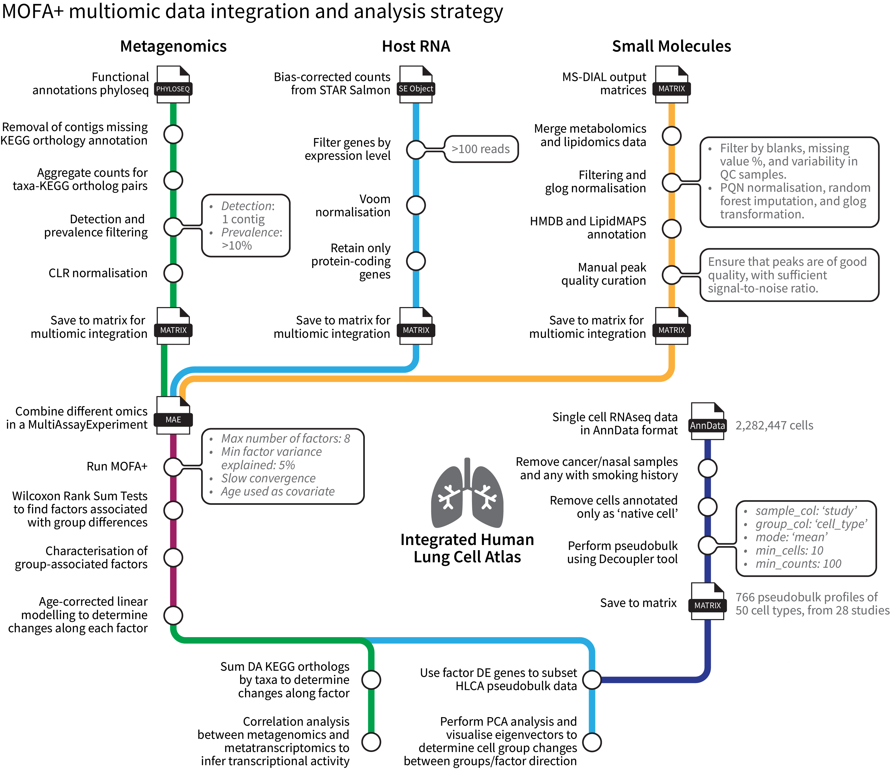
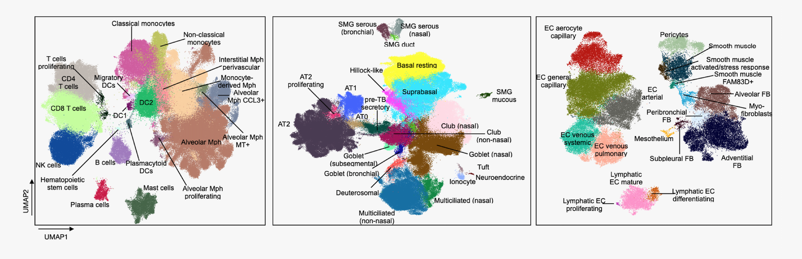

# Multi-omic data analysis of groups 2-4 of the Breathing Together study

Here we present the data processing and subsequent multi-omic integration and analysis pipeline utilised in analysing bronchial brush and bronchoalveolar lavage fluid from the Breathing Together Cohort groups 2-4. 

For context, the groups are as follows:

* **Group 2**: healthy preschool-aged controls
* **Group 3**: preschool children with severe recurrent wheeze
* **Group 4**: school-aged children diagnosed with asthma



- [Multi-omic data analysis of groups 2-4 of the Breathing Together study](#multi-omic-data-analysis-of-groups-2-4-of-the-breathing-together-study)
  - [1) Host RNA sequencing data processing](#1-host-rna-sequencing-data-processing)
    - [Cluster steps](#cluster-steps)
    - [R steps](#r-steps)
  - [2) Bacterial DNA sequencing data processing](#2-bacterial-dna-sequencing-data-processing)
    - [Cluster steps](#cluster-steps-1)
  - [3) Bacterial RNA metatranscriptomic sequencing data processing](#3-bacterial-rna-metatranscriptomic-sequencing-data-processing)
    - [Mapping data to clean metagenomic coassembly sequences](#mapping-data-to-clean-metagenomic-coassembly-sequences)
    - [Correlation analysis between metagenomic and metatranscriptomic data](#correlation-analysis-between-metagenomic-and-metatranscriptomic-data)
  - [4) Bronchoalveolar lavage (BAL) LCMS data processing](#4-bronchoalveolar-lavage-bal-lcms-data-processing)
  - [5) Multi-omic integration with MOFA+](#5-multi-omic-integration-with-mofa)
    - [Pseudo-bulk analysis](#pseudo-bulk-analysis)


## 1) Host RNA sequencing data processing

### Cluster steps

Raw RNA sequencing FASTQ files were processed using the [NF-CORE rnaseq pipeline](https://nf-co.re/rnaseq/3.12.0) (version 3.10.1) as described. Briefly, reads underwent initial quality control (QC) with FastQC, UMIs were extracted with UMI-tools, adapters removed, and quality trimming performed with Trim Galore. Genomic contaminants and ribosomal components were removed with BBSplit and SortMeRNA respectively. Reads were aligned and quantified via a combination of STAR and Salmon tools, and sorted and indexed using SAMtools, and dereplicated with UMI-tools. An abundance matrix was produced, representing scaled and normalised transcripts per million reads, from which a re-estimated counts table was generated for downstream analysis.

### R steps

An RMarkdown file with the R-based data processing is provided [here](./01_HostTranscriptomics.Rmd).  Gene data was filtered for a minimum of 100 reads per sampling group using the [edgeR](https://bioconductor.org/packages/release/bioc/html/edgeR.html) package (version 3.42.0) filterByExpr function, followed by voom normalisation with [limma](https://bioconductor.org/packages/release/bioc/html/limma.html) (version 3.56.0), and removal of non-protein-coding genes. Voom-normalised data matrix was saved for multi-omic integration.


## 2) Bacterial DNA sequencing data processing

Raw shotgun sequencing reads were processed as previously described using the [Sunbeam pipeline](https://sunbeam.readthedocs.io/en/stable/) for adaptor trimming, quality control (QC), host genome decontamination, assembly of contiguous sequences, and co-assembly. Contig taxonomy was estimated using [Kraken 2](https://ccb.jhu.edu/software/kraken2/).

### Cluster steps

These steps were performed on the [M3 MASSIVE cluster](https://www.massive.org.au/). The following Sunbeam commands will run the previous steps including the QC prior to assembly and co-assembly.

```bash
# Assembly with Megahit - assembles reads to produce longer contiguous sequences
sunbeam run --configfile sunbeam_config.yml --cluster "sbatch --job-name=sunbeam_all_assembly --account=of33 --time=04:00:00 --mem-per-cpu=8G --ntasks=1 --cpus-per-task=20 --partition=genomics --qos=genomics" -j 8 -w 60 -p all_assembly --max-jobs-per-second 1 --keep-going

# Coassembly - produces a single file with all contiguous sequences
sunbeam run --configfile sunbeam_config.yml --cluster "sbatch --job-name=sunbeam_all_coassembly --account=of33 --time=04:00:00 --mem-per-cpu=8G --ntasks=1 --cpus-per-task=20 --partition=genomics --qos=genomics" -j 8 -w 60 -p --use-conda all_coassemble --rerun-incomplete --max-jobs-per-second 1 --keep-going

# Create a new folder for Anvi'o-related tasks
# Then copy the co-assembly file
mkdir -p anvio; cd anvio
cp ../sunbeam_output/assembly/coassembly/all_final_contigs.fa .

# Reformat fasta file and filter for contigs >500
anvi-script-reformat-fasta all_final_contigs.fa -o contigs-fixed.fa -l 500 --simplify-names
```

Individual FASTQ files were aligned and mapped to the co-assembly using a [custom script](./map_contigs.sh) built around [bowtie2](https://github.com/BenLangmead/bowtie2). Per-sample contig counts generated using a second [custom bash script](./scripts/contig_counts.sh).

```bash
# Build a bowtie2 index from the co-assembly
bowtie2-build contigs-fixed.fa assembly

# Run the contig mapping step for each of your samples
bash map_contigs.sh
```

The output from this is a set of `.txt` files with contig names (`RNAME`, i.e. read name) and counts that were saved to the local computer to be combined into a counts matrix in R.

```bash
count  RNAME
      2 c_000000000054
      2 c_000000000185
      7 c_000000000398
     90 c_000000000445
     28 c_000000000616
      2 c_000000000650
      2 c_000000000748
      2 c_000000000755
      4 c_000000000958
# etc.
```

The following steps are provided in an [RMarkdown file](./02_Metagenomics.Rmd). To decontaminate the contigs, any sequence found in the extraction negative controls was removed. Using the ratio of reads before and after decontamination, samples with >90% non-contaminant reads were retained. A decontaminated co-assembly FASTQ file was generated from the remaining contigs. This clean co-assembly was used to build an Anvi'o contigs database, from which the amino acid sequences for each gene call could be retrieved and used as input for functional KEGG orthology (KO) assignment using the [GhostKOALA](https://www.kegg.jp/ghostkoala/) tool provided by the Kyoto Encyclopedia of Genes and Genomes. The relevant steps for building the database and parsing GhostKOALA assignments can here found in more detail [here](https://github.com/mucosal-immunology-lab/microbiome-analysis/wiki/Anvio-pipeline).

The dataset was then agglomerated using taxonomy to produce taxa-KO pairs with their associated counts. Using the R [microbiome](https://bioconductor.org/packages/release/bioc/html/microbiome.html) package (version 1.22.0), the dataset was filtered using a detection threshold of 1 in at least 10% of samples via the core function, and centralised log-ratio (CLR)-normalised via the transform function. The final dataset was saved as a matrix for multi-omic data integration.

## 3) Bacterial RNA metatranscriptomic sequencing data processing

### Mapping data to clean metagenomic coassembly sequences

In order to allow for assessment of bacterial transcriptional activity, host-decontaminated RNA sequences were mapped to the clean metagenomic coassembly (i.e. the coassembly FASTA file after removal of contaminant sequences) using [bowtie2](https://github.com/BenLangmead/bowtie2) and the custom bash scripts for [mapping](./scripts/map_contigs.sh) and [contig counting](./scripts/contig_counts.sh) as above.

Just as with the metagenomics data, the metatranscriptomic contig counts data was assembled into a phyloseq object, and underwent CLR normalisation.

### Correlation analysis between metagenomic and metatranscriptomic data

Normalised metagenomic and metatranscriptomic contig data were separately stratified at the deepest taxonomic level available. Spearman correlations were then performed between the two taxa-stratified datasets on the mean contig counts per sample (we were not interested at this point in per-gene correlations). A cut-off significance threshold of 0.05 was used to identify significant correlations.

An [R Markdown file](./03_Metatranscriptomics.Rmd) is provided to show the steps.

## 4) Bronchoalveolar lavage (BAL) LCMS data processing

Raw LCMS data from both metabolomic and lipidomic samples run on a Q-Exactive Orbitrap mass spectrometer (Thermo Fisher) were processed using the [metabolome-lipidome-MSDIAL pipeline](https://github.com/respiratory-immunology-lab/metabolome-lipidome-MSDIAL), incorporating [MS-DIAL (version 5.1)](http://prime.psc.riken.jp/compms/msdial/main.html), the [human metabolome database (HMDB, version 4 - July 2021)](https://hmdb.ca/), and the [pmp](https://bioconductor.org/packages/release/bioc/html/pmp.html) (version 1.4.0) R package. Please visit the [pipeline](https://github.com/respiratory-immunology-lab/metabolome-lipidome-MSDIAL) for complete details.

An [R Markdown file](./04_SmallMolecules.Rmd) is provided showing the steps used, as there are some minor variations from the above pipeline, such as not using the `pmp_preprocess()` function to allow incorporation of both metabolomic and lipidomic datasets into a single final "small molecules" dataset. This was done to maximise the number of features in the small molecules dataset to get closer to evenness of feature numbers between omic datasets at the multi-omic integration step.

The final dataset was saved as a matrix for multi-omic data integration.

## 5) Multi-omic integration with MOFA+

An [R Markdown file](./05_Multiomics.Rmd) of the following steps is provided. The three input matrices were assembled into a [MultiAssayExperiment](https://github.com/waldronlab/MultiAssayExperiment) object. Data was integrated using Multi-Omics Factor Analysis [(MOFA)](https://biofam.github.io/MOFA2/), with slow convergence, a seed value of 2 for generation of pseudo-random numbers, 5% minimum explained variance threshold for factor retention, and sampling age used as a covariate. As model inputs, we supplied voom-normalised host transcriptomics data with a read count threshold of 100, centralised log-ratio (CLR)-normalised metagenomic KEGG ortholog count data with a detection threshold of 1 in >10% of samples, and a combined small molecules dataset. Wilcoxon rank sum tests were used to assess categorical differences in the resulting latent factors, and Spearman correlation analyses were used to assess continuous variables.

Factors that showed significant differences between patient groups were used as predictors for age-corrected linear modelling on the individual MOFA-imputed datasets using a custom script built around limma (i.e. [`bio_limma`](./scripts/bio_limma.R)). Benjamini-Hochberg multiple testing correction was used with a significance threshold of 0.05. Log fold-change threshold was 0.5 for host RNA and small molecules, and 0.25 for bacterial metagenomics.

To summarise bacterial metagenomic changes following linear modelling, KO functional gene counts were stratified by taxa, filtered for a minimum count of 10, and the log-transformed value of the sum of increased (positive) and decreased (negative) gene counts calculated to determine the net change in gene count abundance per taxa along the MOFA factor.

### Pseudo-bulk analysis

To gain a broader view of which cell types may be most affected by the latent factors identified, a pseudo-bulk analysis was performed on a subset of the integrated human lung cell atlas (HLCA), the most comprehensive lung single-cell database, capturing the majority of cell types in the airways with the exception of granulocytes.



The full integrated human lung cell atlas [single-cell RNA sequencing dataset](https://cellxgene.cziscience.com/collections/6f6d381a-7701-4781-935c-db10d30de293) was downloaded and subsetted to omit cells from individuals with cancer or any smoking history, nasal samples, and cells annotated as ‘native cell’. The post-download (but pre-R) steps are provided [here](./scripts/HLCA_pseudobulk.py).

Gene expression data underwent pseudo-bulk processing by cell type for each study using decoupleR [39]. Mode was set to ‘mean’, with a gene read count threshold of 100 and expression in at least 10 cells. The final dataset was batch-corrected with ComBat_seq [40], and contained 766 profiles, covering 50 cell types from 28 studies. For analysis, data was subsetted to include only multi-omic factor differential genes and used for principal component analysis and biplot generation. Labels around the periphery were added to represent the biplot segment covered by a given cell type from the centre to the extents of 95% confidence ellipses.